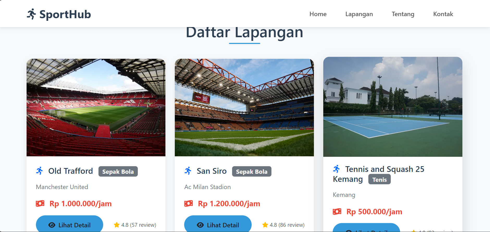
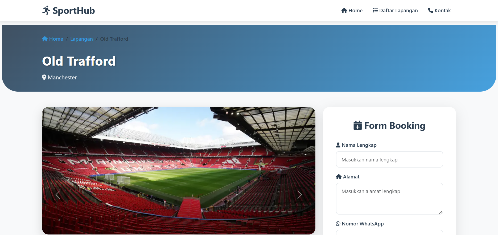
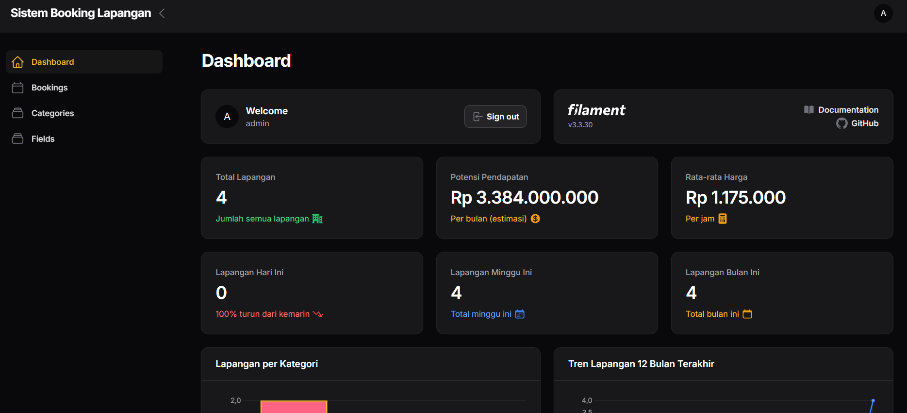

# ⚽ Booking Lapangan

<div align="center">
  
  
  <h3>🏟️ Solusi Terdepan untuk Pemesanan Lapangan Olahraga</h3>
  
  <p>
    <strong>Booking Lapangan</strong> adalah platform digital yang memudahkan Anda untuk memesan lapangan olahraga favorit kapan saja dan di mana saja. Dengan teknologi terkini dan antarmuka yang user-friendly, nikmati pengalaman booking yang tak terlupakan!
  </p>

  <p>
    
    
    
    
  </p>

  <p>
    <a href="#-fitur-unggulan">Fitur</a> •
    <a href="#-instalasi">Instalasi</a> •
    <a href="#-teknologi">Teknologi</a> •
    <a href="#-kontribusi">Kontribusi</a> •
    <a href="#-lisensi">Lisensi</a>
  </p>
</div>

---

## 🌟 Fitur Unggulan

<table>
  <tr>
    <td align="center" width="200">
      
      <br><strong>Pencarian Cerdas</strong>
      <br><small>Temukan lapangan berdasarkan kategori, lokasi, dan tanggal dengan filter canggih</small>
    </td>
    <td align="center" width="200">
      
      <br><strong>Booking 24/7</strong>
      <br><small>Lakukan pemesanan kapan saja tanpa batasan waktu</small>
    </td>
    <td align="center" width="200">
      
      <br><strong>Pembayaran Aman</strong>
      <br><small>Sistem pembayaran terpercaya dengan enkripsi tingkat tinggi</small>
    </td>
  </tr>
  <tr>
    <td align="center" width="200">
      
      <br><strong>Kualitas Terjamin</strong>
      <br><small>Semua lapangan telah melalui verifikasi dan kontrol kualitas ketat</small>
    </td>
    <td align="center" width="200">
      
      <br><strong>Customer Support</strong>
      <br><small>Tim dukungan pelanggan siap membantu 24/7</small>
    </td>
    <td align="center" width="200">
      
      <br><strong>Responsif</strong>
      <br><small>Akses dari smartphone, tablet, atau desktop dengan mudah</small>
    </td>
  </tr>
</table>

---

## 🚀 Instalasi

### Prasyarat
Pastikan Anda telah menginstal:
- PHP >= 8.0
- Composer
- MySQL/MariaDB
- Node.js & NPM (opsional)

### Langkah Instalasi

```bash
# 1. Clone repository
git clone https://github.com/username/booking-lapangan.git
cd booking-lapangan

# 2. Install dependencies
composer install
npm install && npm run build  # Jika menggunakan asset build

# 3. Setup environment
cp .env.example .env
php artisan key:generate
```

### Konfigurasi Database

1. **Buat database baru**
   ```sql
   CREATE DATABASE booking-lapangan;
   ```

2. **Konfigurasi file `.env`**
   ```env
   DB_CONNECTION=mysql
   DB_HOST=127.0.0.1
   DB_PORT=3306
   DB_DATABASE=booking-lapangan
   DB_USERNAME=your_username
   DB_PASSWORD=your_password
   ```

3. **Import database & jalankan migrasi**
   ```bash
   # Jika menggunakan file SQL
   mysql -u your_username -p booking0lapangan < database/booking-lapangan.sql
   
   # Atau jalankan migrasi
   php artisan migrate --seed
   ```

### Menjalankan Aplikasi

```bash
# Jalankan server development
php artisan serve

# Akses aplikasi di browser
# http://localhost:8000
```

### 🔐 Akun Default

| Role | Email | Password |
|------|--------|----------|
| **Admin** | admin@gmail.com | admin123 |
| **User** | user@gmail.com | user123 |

---

## 🛠️ Teknologi

<div align="center">
  <table>
    <tr>
      <td align="center">
        
        <br><strong>Laravel</strong>
        <br><small>Framework Backend</small>
      </td>
      <td align="center">
        
        <br><strong>Bootstrap</strong>
        <br><small>CSS Framework</small>
      </td>
      <td align="center">
        
        <br><strong>MySQL</strong>
        <br><small>Database</small>
      </td>
      <td align="center">
        
        <br><strong>Sanctum</strong>
        <br><small>Authentication</small>
      </td>
    </tr>
  </table>
</div>

### Stack Teknologi Detail

- **Backend**: Laravel 10.x dengan arsitektur MVC
- **Frontend**: Blade Templates + Bootstrap 5
- **Database**: MySQL dengan Eloquent ORM
- **Authentication**: Laravel Sanctum untuk API security
- **Styling**: Bootstrap + Custom CSS
- **Icons**: Font Awesome / Bootstrap Icons

---

## 📸 Screenshot

<div align="center">
  
  
  
</div>
---

## 🤝 Kontribusi

Kami sangat menghargai kontribusi dari komunitas! Berikut cara untuk berkontribusi:

1. **Fork** repository ini
2. **Buat branch** untuk fitur baru (`git checkout -b feature/AmazingFeature`)
3. **Commit** perubahan Anda (`git commit -m 'Add some AmazingFeature'`)
4. **Push** ke branch (`git push origin feature/AmazingFeature`)
5. **Buka Pull Request**

### 💡 Ide Kontribusi

- 🐛 **Bug Reports**: Laporkan bug yang Anda temukan
- 💻 **Code Improvements**: Tingkatkan kualitas kode
- 📚 **Documentation**: Perbaiki atau tambahkan dokumentasi
- 🎨 **UI/UX**: Tingkatkan tampilan dan pengalaman pengguna
- 🔧 **New Features**: Tambahkan fitur baru yang bermanfaat

---

## 📞 Dukungan

Butuh bantuan? Jangan ragu untuk menghubungi kami:

- 📧 **Email**: diansiahaan663@gmail.com.com
- 💬 **Discord**: [Join our community](https://discord.gg/bookinglapangan)
- 📱 **WhatsApp**: +62 878-6160-8686
- 🐛 **Issues**: [GitHub Issues](https://github.com/username/booking-lapangan/issues)

---

## 🎯 Roadmap

- [ ] **v2.0** - Mobile App (React Native)
- [ ] **v2.1** - Payment Gateway Integration
- [ ] **v2.2** - Real-time Chat Support
- [ ] **v2.3** - Advanced Analytics Dashboard
- [ ] **v2.4** - Multi-language Support

---

## 📄 Lisensi

Proyek ini dilisensikan di bawah [MIT License](LICENSE) - lihat file LICENSE untuk detail lebih lanjut.

---

<div align="center">
  <p>
    <strong>⭐ Jika proyek ini bermanfaat, jangan lupa berikan star! ⭐</strong>
  </p>
  
  <p>
    Dibuat dengan ❤️ oleh <a href="https://github.com/ardiansyah663">Ardiansyah Gagah Ganteng</a>
  </p>
  
  <p>
    <a href="https://github.com/username/booking-lapangan">🏠 Repository</a> •
    <a href="https://bookinglapangan.com">🌐 Live Demo</a> •
    <a href="https://docs.bookinglapangan.com">📖 Documentation</a>
  </p>
</div>
